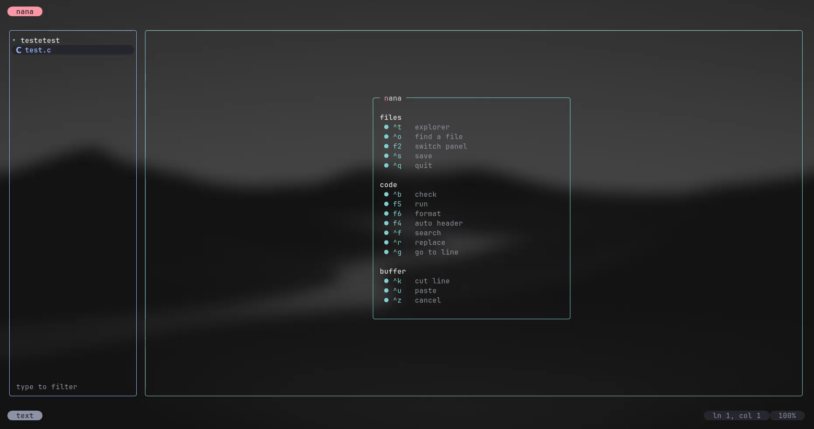
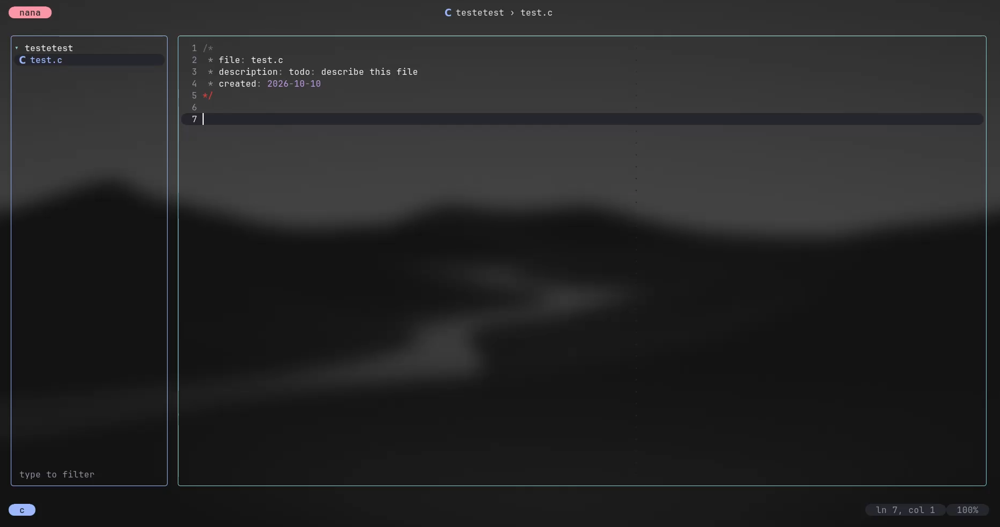
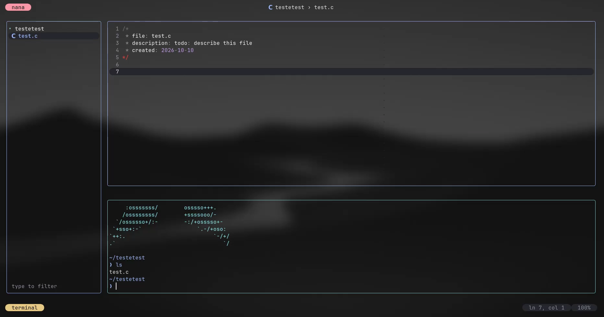
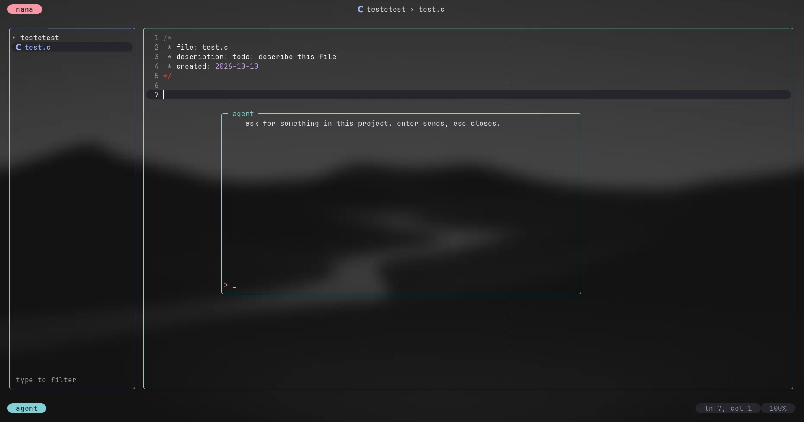

# nana

an adaptive terminal editor. one buffer, every language.

version 2.0.



## what it is

nana is a small, fast, keyboard-driven editor for the terminal — and it knows
what you are editing. open a `.py` and you get python's own syntax check; open a
`.rs` inside a cargo project and `f5` runs `cargo run`; open a `.md` and the
header key writes an html comment, not a C one. there is no plugin to install
and no language server to babysit: the language table is in the binary.

it is written in rust, it is a single static binary, and it starts instantly.

## why

most editors make you configure languages one by one. nana ships the knowledge
instead: **105 languages**, their comment syntax, their checker, their run
recipe, their formatter, their icon — plus project detection for the common
build systems and frameworks. the whole table lives in one file
([`src/langs.rs`](src/langs.rs)), so adding a language is adding a row.

### c, in a project

the badge names the language, the right of the top bar names the project, and the gutter is calm.



### `f5` runs it

the built-in terminal runs the project's command when there is one, the file's
own recipe otherwise. it is a real pty, and it answers terminal queries, so
modern shells start cleanly inside it.



## install

from source (rust 1.75+):

```sh
git clone https://github.com/mitige/nana
cd nana
cargo build --release
install -m755 target/release/nana ~/.local/bin/nana
```

or straight from this checkout:

```sh
cargo install --path .
```

then:

```sh
nana              # opens the current directory
nana src/main.rs  # opens a file
nana src          # opens a directory
```

## keys

| key | what it does |
| --- | --- |
| `ctrl+s` | save (runs the check afterwards) |
| `ctrl+q` | quit (`ctrl+x` too) |
| `ctrl+z` | undo |
| `ctrl+k` / `ctrl+u` | cut / paste a line |
| `ctrl+f` / `ctrl+r` | search / replace |
| `ctrl+g` | go to line |
| `ctrl+t` | file explorer |
| `ctrl+o` | fuzzy file search |
| `f2` | cycle panels |
| `f3` / `super+t` | terminal (`super+t` needs a terminal that sends the super key, e.g. kitty, wezterm, foot, ghostty) |
| `ctrl+b` | check the file (compiler, linter, parser) |
| `f5` | run (project command, or the file itself) |
| `f6` | format (prettier, rustfmt, gofmt, black…) |
| `f4` | auto header, in the language's comment syntax |
| `ctrl+n` / `ctrl+p` | next / previous diagnostic |
| `tab` | accept the completion suggestion, else indent |

## languages

105 rows today. the checker column is what `ctrl+b` runs; the run column is
what `f5` runs for a single file (in a project, the project command wins).

| language | extensions | checker | run |
| --- | --- | --- | --- |
| c | `c` `h` | gcc | gcc + exec |
| c++ | `cpp` `cc` `cxx` `hpp` | g++ | g++ + exec |
| rust | `rs` | rustc | rustc + exec (cargo in a project) |
| go | `go` | gofmt | go run |
| zig | `zig` | zig ast-check | zig run |
| python | `py` `pyi` | python3 (ast) | python3 |
| javascript | `js` `mjs` `cjs` `jsx` | node --check | node |
| typescript | `ts` `tsx` | tsc | — |
| java | `java` | javac | javac + java |
| kotlin | `kt` | — | kotlin |
| ruby | `rb` | ruby -c | ruby |
| php | `php` | php -l | php |
| lua | `lua` | luac -p | lua |
| perl | `pl` `pm` | perl -c | perl |
| swift | `swift` | swiftc -typecheck | swift |
| haskell | `hs` | ghc -fno-code | runghc |
| elixir | `ex` `exs` | elixir -c | elixir |
| dart | `dart` | dart analyze | dart run |
| r | `r` `R` | — | Rscript |
| julia | `jl` | — | julia |
| bash | `sh` `bash` `zsh` | bash -n | bash |
| fish | `fish` | fish --no-execute | fish |
| powershell | `ps1` | pwsh | — |
| assembly | `s` `asm` `nasm` | gcc -x assembler | gcc + exec |
| html | `html` `htm` `hbs` `twig` | — | — |
| css / scss | `css` `scss` `sass` `less` | — | — |
| markdown | `md` `mdx` | — | — |
| latex | `tex` `sty` | — | — |
| json | `json` `jsonc` | python3 json.tool | — |
| yaml | `yaml` `yml` | python3 yaml | — |
| toml | `toml` | python3 tomllib | — |
| sql | `sql` | — | — |
| dockerfile | `Dockerfile` | — | — |
| make | `Makefile` | — | make |
| nix | `nix` | nix-instantiate | — |

the full list, generated from the registry:

```sh
nana --languages
```

105 languages, from ada to zig, including the ones people forget: forth, cobol,
prolog, smalltalk, brainfuck-adjacent oddities aside — webassembly (`wat`),
llvm ir (`ll`), glsl and wgsl for the gpu, protobuf, thrift, graphql, terraform,
ansible, nginx, vimscript, emacs lisp, org, restructuredtext, asciidoc, typst,
csv, diff, dotenv, gitconfig.

## how it adapts

- **the registry** (`src/langs.rs`) — comment syntax, icon, colour, checker,
  run recipe, formatter, per language. nothing else hard-codes a language.
- **the project** (`src/project.rs`) — walks up from the file to the first
  marker it understands: `Cargo.toml`, `package.json` (scripts + lockfile +
  framework: next, vite, svelte, astro, nest…), `pyproject.toml` (django,
  flask), `go.mod`, `Makefile`, `CMakeLists.txt`, `meson.build`, `pom.xml`,
  `build.gradle`, `*.csproj`, `build.zig`, `docker-compose.yml`. the project's
  own command wins over the file's recipe for run / build / test / format.
- **the diagnostics** (`src/diag.rs`) — one parser for every dialect: gcc and
  clang and javac and swift and go (`path:line:col: error: msg`), rustc
  (`error[E0308]:` + `--> path:line:col`), typescript (`path(l,c): error
  TS1234:`), python (`File "x", line n` + `SyntaxError:`), node (`x.js:12` +
  `SyntaxError:`), luac, bash (`x.sh: line 12:`), perl, php (`… on line 12`).
  a missing toolchain is never a finding — it is a note, once.
- **the terminal** (`src/editor.rs`, `TermPane`) — a real pty. it replies to
  device attributes, colour and cursor queries, so shells that wait for a
  terminal answer (fish, starship, and friends) come up instead of hanging.
- **the check** (`src/check.rs`) — after every save, off the ui thread: the
  language's checker plus a sober universal pass (trailing whitespace, tabs,
  final newline, line length). results land in the gutter and the status line.

## the agent

nana is also an agent. it reads your project, it can act on it, and it keeps
what it learns — per project, on disk, in markdown you can read and edit.

### the panel

`ctrl+a` opens the agent. the menu takes the whole screen, like the hub: nothing
of the ide is drawn behind it. type your request, `enter` sends it, `esc`
closes the menu — and `esc` again while it is thinking cancels the request.



the card shows the whole exchange as it happens:

```
you   read src/langs.rs and tell me how many languages the registry declares
->    read_file {"path": "src/langs.rs"}
ok    read_file 1 | //! the language registry.
nana  the registry declares 105 languages, including forth, cobol and prolog.
```

the answer streams in, the tool calls are shown with their arguments, and a
refusal is shown too — nothing is hidden from you.

### the tools it has

| tool | what it does |
| --- | --- |
| `read_file` | read a file of the project, lines numbered |
| `write_file` | write a file, creating it or replacing it |
| `edit_file` | replace one exact passage, refused if ambiguous |
| `list_dir` | list a directory |
| `grep` | search the project, `file:line` matches |
| `run_shell` | run a command inside the project |
| `memory_list` / `memory_read` / `memory_write` | the project's memory |

two rules hold everywhere: **every path is resolved inside the project and
checked**, and **a destructive command is refused**. `rm -rf`, `dd of=`,
`git reset --hard`, `git push --force`, `sudo`, `mkfs` and friends are
recognised before they run; the refusal is handed back to the model, which
sees it and changes plan instead of pretending it worked.

### memory, scoped to one project

`<project>/.nana/memory/<class>/<name>.md`, four classes: `user` (who you
are), `feedback` (what you told the agent about itself), `project` (stack,
conventions, decisions), `reference` (pointers).

memory is **scoped by construction**: an agent opened in one project cannot
read or write another project's memory. that is what keeps it useful instead
of bloated. the prompt carries only the index — names, not contents — and the
agent reads a page when it becomes relevant.


```sh
nana --memory list
nana --memory search "convention"
nana --memory show project stack
nana --memory write project stack <<'EOF'
rust, no async, every feature gets a test
EOF
```

### the wiki: what the project taught

memory holds facts about you and the project; the wiki holds **what the work
taught**: how the build really runs, which test is flaky, why a decision was
made. pages are markdown under `<project>/.nana/knowledge/`, and the agent is
told which pages exist, never their contents — it opens one when it matters.

```sh
nana --knowledge               # the pages, and the recent audits
nana --knowledge show build
nana --knowledge search "release"
nana --dream 10                # consolidate the last 10 sessions into the wiki
```

`--dream` reads the latest sessions and writes back what they taught: new or
updated pages, plus a dated page under `knowledge/audit/` that lists what it
read and what it changed. the audit is the history, so the change itself is
reviewable with `git diff`. nothing is rewritten silently.

### the hub: the boxes

`ctrl+w` opens the hub: the project's boxes side by side, a navigation card on
the left and the detail of what you selected on the right. everything that
would otherwise send you to a shell happens here.

| box | what you can do in it |
| --- | --- |
| memory | read a page, write a new one, edit it, forget it |
| knowledge | read a wiki page, write one, dream over the last sessions |
| providers | see who can answer, pick the model with a keystroke |
| skills | read one, run it (it hands itself to the agent), write a new one |
| personas | read it, use it by default, edit it, delete it |
| agents | the company: hire, give work, fire, follow the mailbox |

keys inside the hub:

| key | what it does |
| --- | --- |
| `↑` `↓` | move in the list |
| `←` `→` | change box |
| `enter` | act on the selection, or answer what the box is asking |
| `ctrl+n` | new: a memory page, a persona, a skill, or a mission for the ceo |
| `ctrl+e` | edit the file behind the selection, right here in nana |
| `ctrl+d` | delete it: forget a page, delete a persona, fire an employee |
| `ctrl+t` | give the selected employee a task |
| typing | filters the list |
| `esc` | close the hub |

the box asks for what it needs in its own line, keeps working while the ceo
thinks, and shows what happened in the right card. nothing here needs a
terminal command.

### the company

the `agents` box is a small company inside your project. you give the **ceo**
a mission; it hires the smallest team that can do the work, each employee with
a role and a system prompt of its own. then you give an employee a task, and
that task is an ordinary agent run under that employee's persona — with the
tools, the project's `AGENTS.md`, its skills and its memory.

```
you:    add a --version flag to the cli
ceo:    hired rio (cli engineer) — owns the flag end to end
you:    (rio) read src/bin/nana.rs and say where the version is printed
rio:    → read_file {"path": "src/bin/nana.rs"}
        the version is printed in main, in the --version arm
        per AGENTS.md i will write the failing test first…
        → write_file tests/version.rs
        → run_shell cargo test
        test result: ok. 1 passed
```

the roster is `.nana/agents/roster.json` and the mailbox is
`.nana/agents/tasks.jsonl` — both plain json you can read and edit. the org
chart is a file, so it survives the session and you can version it (or delete
it).

from the shell, the same thing:

```sh
nana --company hire "add a --version flag to the cli"
nana --company list
nana --company task rio "write the test for it"
nana --company mail
nana --company fire rio
```

### providers

one client, three wire shapes (openai-compatible, anthropic, gemini) covering
openai, anthropic, gemini, alibaba dashscope, openrouter, ollama and agentic
press. the **model name picks the endpoint**:

| model name contains | provider |
| --- | --- |
| `cheapmodels/...` | cheapmodels (`OPPP_API_KEY`) |
| `claude`, `sonnet`, `opus`, `haiku` | anthropic |
| `gemini` | google |
| `qwen`, `kimi`, `deepseek`, `glm` | alibaba dashscope |
| `gpt-`, `o3`, `o4` | openai |
| `llama`, `mistral`, `phi`, `gemma` | ollama, local, no key |
| `openrouter/…` | openrouter |
| anything else | your own openai-compatible `/v1` |

a key is looked up for its own provider only — from the environment, then from
`~/.dsh/.credentials.yaml` — and it never travels to another vendor. it is not
printed, not logged, and masked even in a debug dump.

```sh
nana --providers          # who can answer, and whether the key is there
```

to point nana at anything: `.nana/settings.json`

```json
{ "model": "llama3.1", "base_url": "http://127.0.0.1:11434/v1" }
```

### personas

a persona is a saved system prompt: a role, a tone, a way of working. it is
markdown with a small header, so you can write and edit it in nana itself.

```sh
nana --persona write reviewer <<'EOF'
The Reviewer
read code like a colleague: precise, direct, no flattery. name the file and line.
EOF
nana --persona list
```

project personas live in `<project>/.nana/personas/`, yours in
`~/.config/nana/personas/`; the project's one wins on a name clash. set a
default with `{"persona": "reviewer"}`.

### skills

a skill is a packaged workflow the agent picks up when your request matches
its trigger. `<project>/.nana/skills/*.md` or the portable
`skills/<name>/SKILL.md`:

```markdown
---
name: release
description: cut a release of nana
trigger: release, tag, changelog
---
1. bump the version in Cargo.toml
2. run cargo test and paste the result line
3. write the changelog
4. tag it and push
```

say "cut a release" and the body is handed to the model, which follows it.

### project instructions

`AGENTS.md` at the root of the repository is read into every prompt. write
your rules there once — how you name things, what you refuse, what "done"
means — and the agent works to them.

`nana --show-prompt "…"` prints exactly what the model receives, section by
section, so you never have to guess what the agent was told.

### conversations

every exchange is kept as json lines in `<project>/.nana/sessions/`, one line
per message: your request, the answer, each tool call and its result. it is
plain text you can grep or delete.

```sh
nana --agent "what does src/diag.rs do?"
nana --agent --resume "and the perl dialect?"   # continues yesterday's thread
```

`.nana/` is git-ignored: it is your notes about your project, not the project.

### from the shell

everything the panel does is also a command, which is how it gets tested:

```sh
nana --agent "…"        one request, every step printed as it runs
nana --show-prompt "…"  the assembled system prompt
nana --providers        the provider table
nana --memory …         the project's memory
nana --persona …        saved system prompts
nana --skills           what this project can hand the agent
nana --company …        the company: hire, task, fire, mail
```

### how the prompt is built

sections, in order: identity, **persona**, `AGENTS.md`, the skill index, the
matched skills, the memory index, the tool rules, the working directory.
the persona sits right after the identity, before everything else — so what
you wrote is what frames the work.

### what is not there yet

not in 2.0 yet: dedicated panels for mcp servers, plugins, agent teams,
scheduled jobs and documents; an mcp client; plan mode. the hub, the company,
memory, providers, skills and personas are in; the rest is on the roadmap.
what exists is verified end to end — the test suite drives a real http server
for the client, and a real tool loop for the agent.

## configuration

optional, created commented-out on first run at `~/.config/nana/config.toml`:

```toml
author = "your name"      # written in the auto header (f4)
max_columns = 100         # 0 disables the long-line note
trailing_whitespace = true
tabs = true
final_newline = true
```

## limitations, honestly

- no language server: completion, refactors and go-to-definition are not there.
- one buffer: no splits, no tabs.
- the agent needs an api key for its provider; the editor itself is fully
  usable without one.
- the ghost completion (`ctrl+e`) is the least finished part: it needs a key
  and a model that follows instructions closely.
- memory is per project by design, so it never becomes one giant store — and
  it never crosses projects either.

## development

```sh
cargo test        # 212 tests, no network, no fixtures to download
cargo run         # the editor, on this repository
cargo run -- --languages
```

## license

mit — see [LICENSE](LICENSE).
