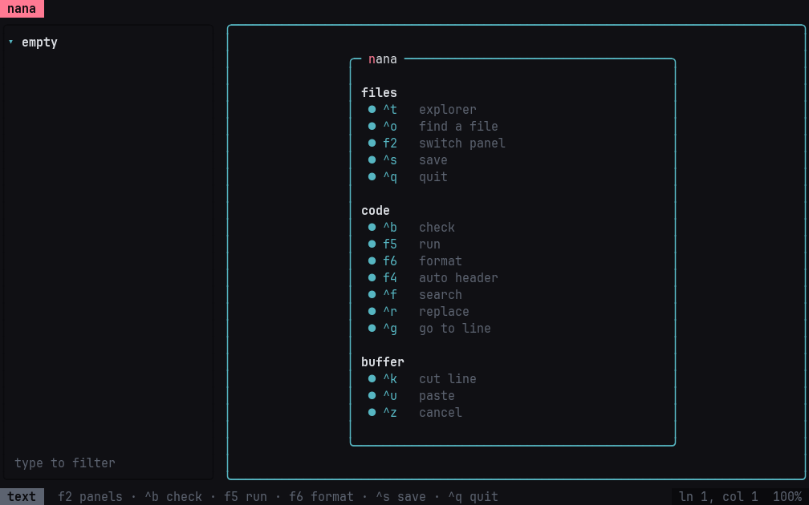
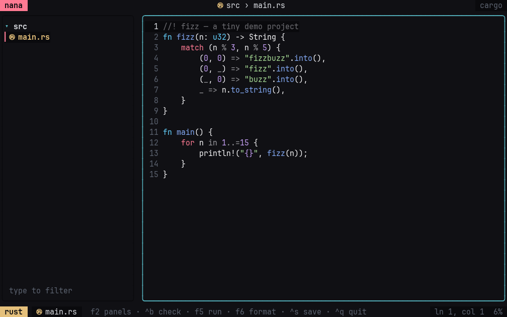
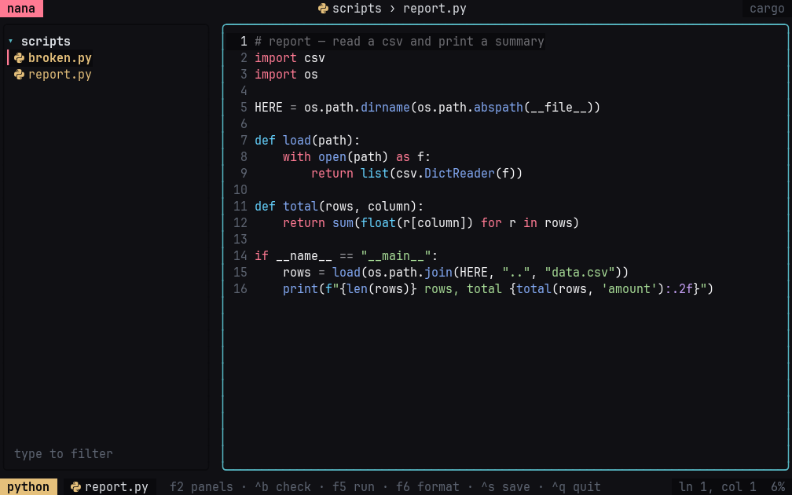
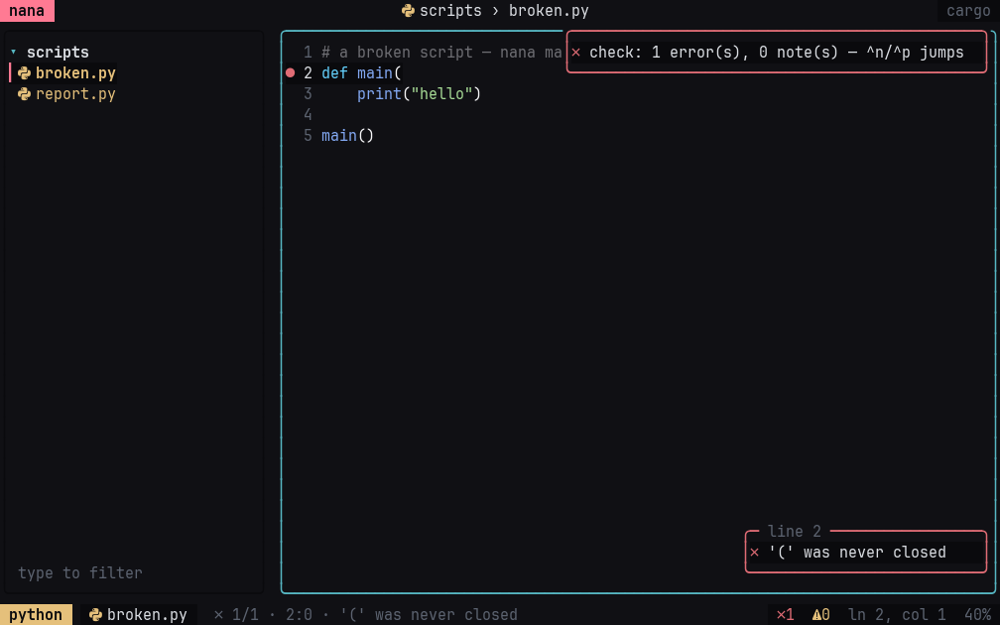
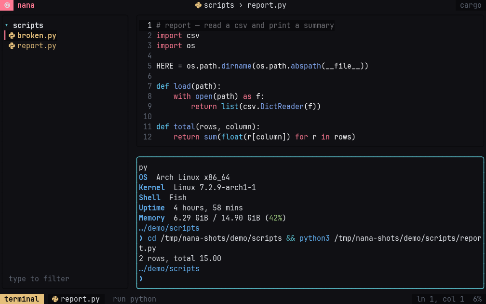
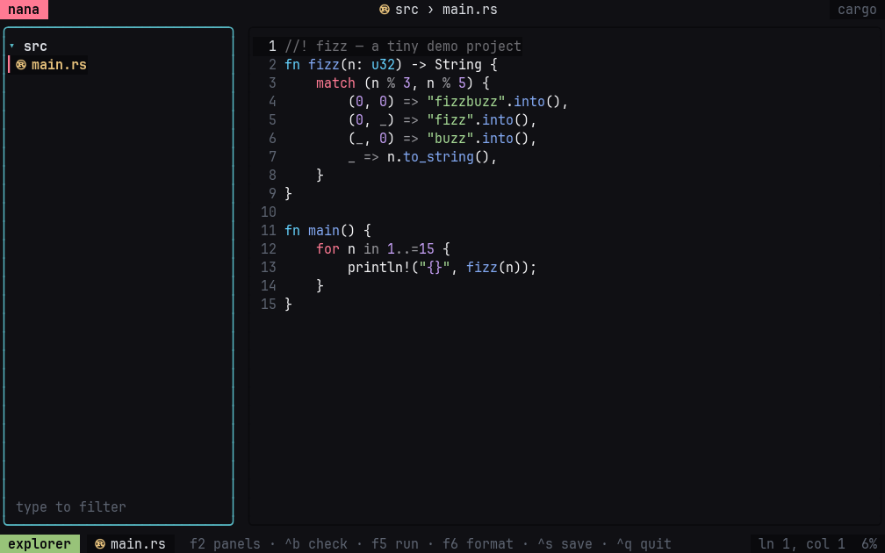
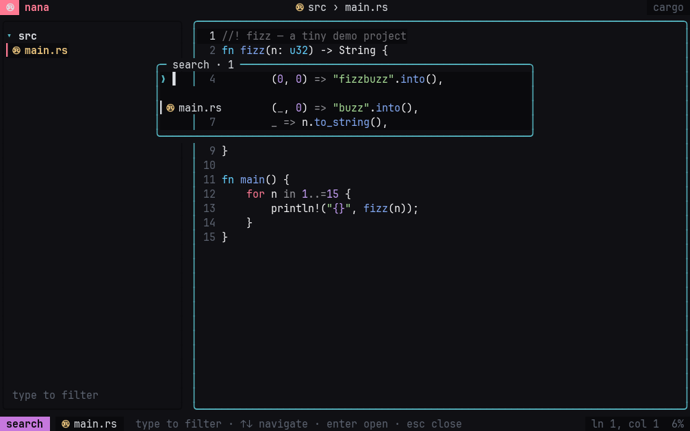

# nana

an adaptive terminal editor. one buffer, every language.



## what it is

nana is a small, fast, keyboard-driven editor for the terminal — and it knows
what you are editing. open a `.py` and you get python's own syntax check; open a
`.rs` inside a cargo project and `f5` runs `cargo run`; open a `.md` and the
header key writes an html comment, not a C one. there is no plugin to install
and no language server to babysit: the language table is in the binary.

it is written in rust, it is a single static binary, and it starts instantly.

## why

most editors make you configure languages one by one. nana ships the knowledge
instead: **105 languages**, their comment syntax, their checker, their run
recipe, their formatter, their icon — plus project detection for the common
build systems and frameworks. the whole table lives in one file
([`src/langs.rs`](src/langs.rs)), so adding a language is adding a row.

## screenshots

### rust, in a cargo project

the badge names the language, the right of the top bar names the project
(`cargo`), and the gutter is calm.



### python, with the explorer

the tree, the fuzzy filter, and the language badge.



### a broken file: the line is marked

`ctrl+b` runs the language's checker — here python's own parser — and the
diagnostic lands on the line, in the gutter and in the popup.



### `f5` runs it

the built-in terminal runs the project's command when there is one, the file's
own recipe otherwise. it is a real pty, and it answers terminal queries, so
modern shells start cleanly inside it.



### panels

`f2` cycles editor → explorer → search → terminal. one surface, no menus.



### fuzzy file search

`ctrl+o` filters the project as you type.



## install

from source (rust 1.75+):

```sh
git clone https://github.com/mitige/nana
cd nana
cargo build --release
install -m755 target/release/nana ~/.local/bin/nana
```

or straight from this checkout:

```sh
cargo install --path .
```

then:

```sh
nana              # opens the current directory
nana src/main.rs  # opens a file
nana src          # opens a directory
```

## keys

| key | what it does |
| --- | --- |
| `ctrl+s` | save (runs the check afterwards) |
| `ctrl+q` | quit (`ctrl+x` too) |
| `ctrl+z` | undo |
| `ctrl+k` / `ctrl+u` | cut / paste a line |
| `ctrl+f` / `ctrl+r` | search / replace |
| `ctrl+g` | go to line |
| `ctrl+t` | file explorer |
| `ctrl+o` | fuzzy file search |
| `f2` | cycle panels |
| `f3` | terminal |
| `ctrl+b` | check the file (compiler, linter, parser) |
| `f5` | run (project command, or the file itself) |
| `f6` | format (prettier, rustfmt, gofmt, black…) |
| `f4` | auto header, in the language's comment syntax |
| `ctrl+n` / `ctrl+p` | next / previous diagnostic |
| `tab` | accept the completion suggestion, else indent |

## languages

105 rows today. the checker column is what `ctrl+b` runs; the run column is
what `f5` runs for a single file (in a project, the project command wins).

| language | extensions | checker | run |
| --- | --- | --- | --- |
| c | `c` `h` | gcc | gcc + exec |
| c++ | `cpp` `cc` `cxx` `hpp` | g++ | g++ + exec |
| rust | `rs` | rustc | rustc + exec (cargo in a project) |
| go | `go` | gofmt | go run |
| zig | `zig` | zig ast-check | zig run |
| python | `py` `pyi` | python3 (ast) | python3 |
| javascript | `js` `mjs` `cjs` `jsx` | node --check | node |
| typescript | `ts` `tsx` | tsc | — |
| java | `java` | javac | javac + java |
| kotlin | `kt` | — | kotlin |
| ruby | `rb` | ruby -c | ruby |
| php | `php` | php -l | php |
| lua | `lua` | luac -p | lua |
| perl | `pl` `pm` | perl -c | perl |
| swift | `swift` | swiftc -typecheck | swift |
| haskell | `hs` | ghc -fno-code | runghc |
| elixir | `ex` `exs` | elixir -c | elixir |
| dart | `dart` | dart analyze | dart run |
| r | `r` `R` | — | Rscript |
| julia | `jl` | — | julia |
| bash | `sh` `bash` `zsh` | bash -n | bash |
| fish | `fish` | fish --no-execute | fish |
| powershell | `ps1` | pwsh | — |
| assembly | `s` `asm` `nasm` | gcc -x assembler | gcc + exec |
| html | `html` `htm` `hbs` `twig` | — | — |
| css / scss | `css` `scss` `sass` `less` | — | — |
| markdown | `md` `mdx` | — | — |
| latex | `tex` `sty` | — | — |
| json | `json` `jsonc` | python3 json.tool | — |
| yaml | `yaml` `yml` | python3 yaml | — |
| toml | `toml` | python3 tomllib | — |
| sql | `sql` | — | — |
| dockerfile | `Dockerfile` | — | — |
| make | `Makefile` | — | make |
| nix | `nix` | nix-instantiate | — |

the full list, generated from the registry:

```sh
nana --languages
```

105 languages, from ada to zig, including the ones people forget: forth, cobol,
prolog, smalltalk, brainfuck-adjacent oddities aside — webassembly (`wat`),
llvm ir (`ll`), glsl and wgsl for the gpu, protobuf, thrift, graphql, terraform,
ansible, nginx, vimscript, emacs lisp, org, restructuredtext, asciidoc, typst,
csv, diff, dotenv, gitconfig.

## how it adapts

- **the registry** (`src/langs.rs`) — comment syntax, icon, colour, checker,
  run recipe, formatter, per language. nothing else hard-codes a language.
- **the project** (`src/project.rs`) — walks up from the file to the first
  marker it understands: `Cargo.toml`, `package.json` (scripts + lockfile +
  framework: next, vite, svelte, astro, nest…), `pyproject.toml` (django,
  flask), `go.mod`, `Makefile`, `CMakeLists.txt`, `meson.build`, `pom.xml`,
  `build.gradle`, `*.csproj`, `build.zig`, `docker-compose.yml`. the project's
  own command wins over the file's recipe for run / build / test / format.
- **the diagnostics** (`src/diag.rs`) — one parser for every dialect: gcc and
  clang and javac and swift and go (`path:line:col: error: msg`), rustc
  (`error[E0308]:` + `--> path:line:col`), typescript (`path(l,c): error
  TS1234:`), python (`File "x", line n` + `SyntaxError:`), node (`x.js:12` +
  `SyntaxError:`), luac, bash (`x.sh: line 12:`), perl, php (`… on line 12`).
  a missing toolchain is never a finding — it is a note, once.
- **the terminal** (`src/editor.rs`, `TermPane`) — a real pty. it replies to
  device attributes, colour and cursor queries, so shells that wait for a
  terminal answer (fish, starship, and friends) come up instead of hanging.
- **the check** (`src/check.rs`) — after every save, off the ui thread: the
  language's checker plus a sober universal pass (trailing whitespace, tabs,
  final newline, line length). results land in the gutter and the status line.

## configuration

optional, created commented-out on first run at `~/.config/nana/config.toml`:

```toml
author = "your name"      # written in the auto header (f4)
max_columns = 100         # 0 disables the long-line note
trailing_whitespace = true
tabs = true
final_newline = true
```

## limitations, honestly

- no language server: completion, refactors and go-to-definition are not there.
- one buffer: no splits, no tabs.
- the ghost completion needs an openai-compatible key in the environment; the
  editor is fully usable without it.

## development

```sh
cargo test        # 111 tests, no network, no fixtures to download
cargo run         # the editor, on this repository
cargo run -- --languages
```

the screenshots in this readme are generated, not hand-taken: a capture of the
real pty stream is replayed through `vt100` (see `examples/vtdump.rs`) and
rendered to png. so they cannot drift from the ui without being regenerated.

## license

mit — see [LICENSE](LICENSE).